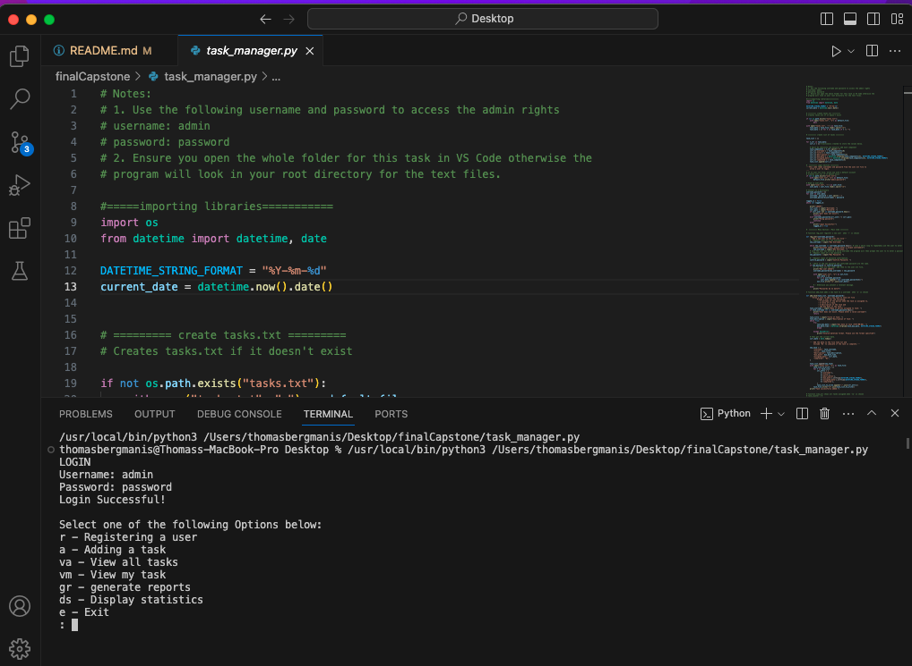
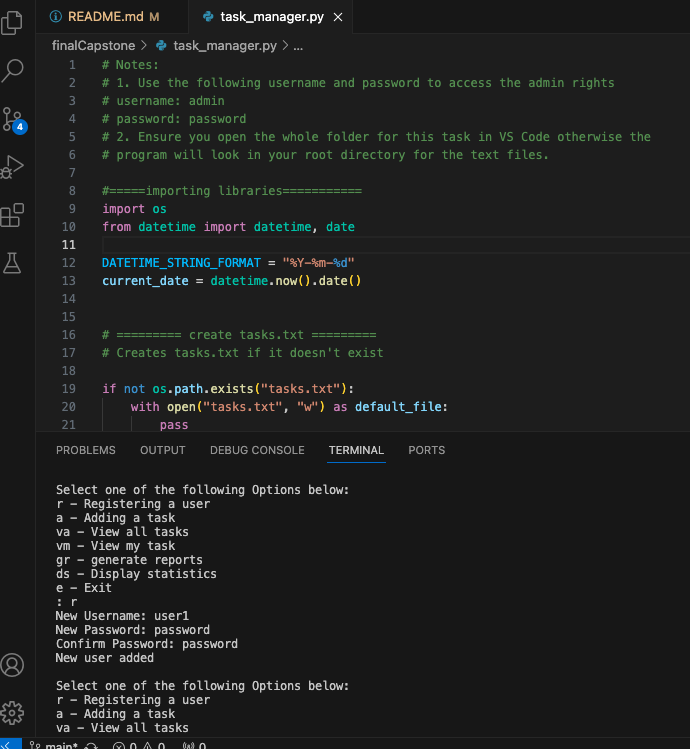
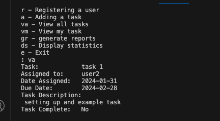
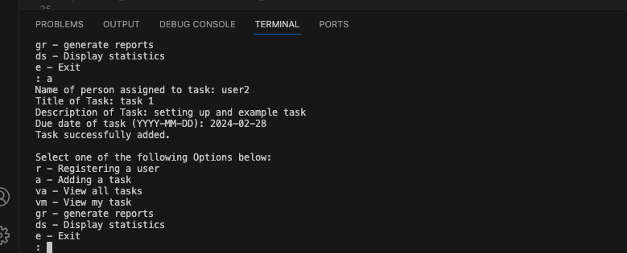
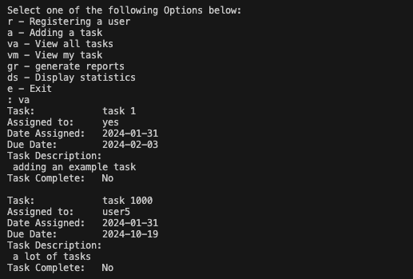
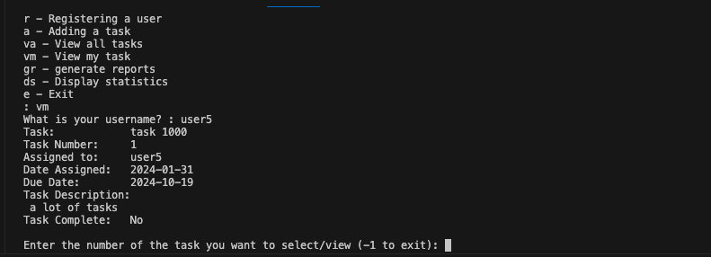
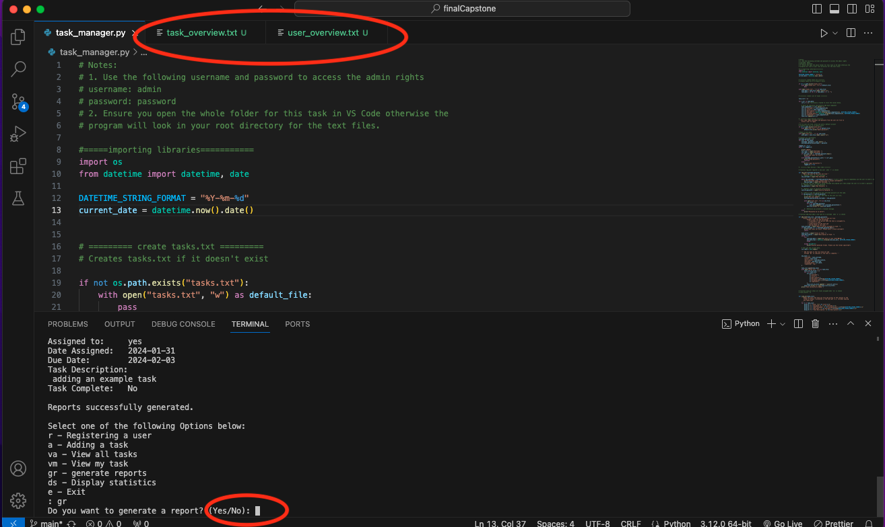
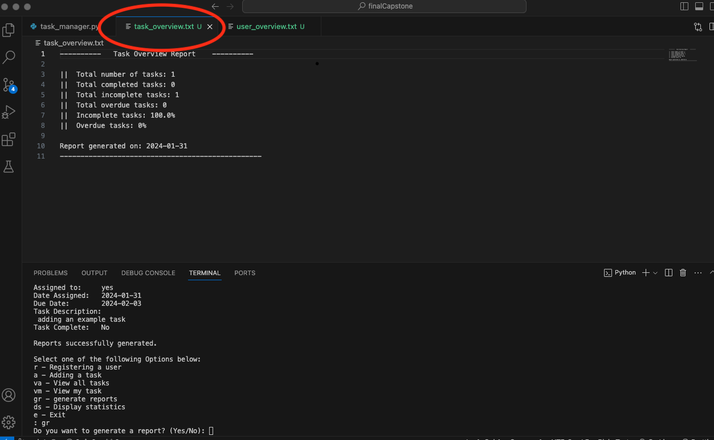
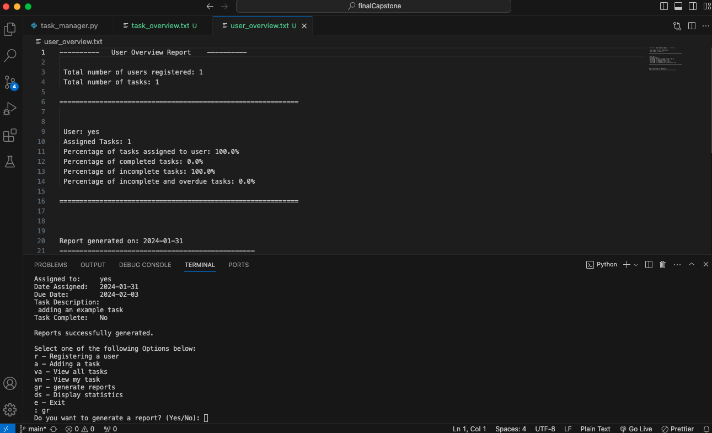

# Task Management System

### Final Capstone project by HyperionDev Skills Bootcamp

A project from HyperionDev Bootcamp creating a task manager in Python.

### INTRODUCTION -

The Task Management System is a Python program designed to manage tasks and user authentication. It provides functionality for registering users, adding tasks, viewing tasks, generating reports, and displaying statistics. The system uses text files (user.txt and tasks.txt) to store user information and task data. Reports are generated in text files (task_overview.txt and user_overview.txt) to display information.

### INSTALLATION -

1. Navigate to the GitHub repository page.
2. On the main page -> click the green Code button.
3. In the menu that appears, click Download Zip/File.
4. On your local machine -> navigate to the downloads folder
5. unzip or extract the downloaded file.
6. open in chosen IDE (VS Code)

### INSTRUCTION / USAGE SECTION -

HOW TO USE THE PROJECT:

The program runs in the terminal and requires user input in order for the program to output meaningful data.

User Authentication -

    Login
    The program prompts users for a username and password to access admin rights. The default admin credentials are:

    Username: admin
    Password: password

    User Registration
    Users can register by providing a unique username and password. The new user information is stored in the user.txt file.

Task Management -

    Tasks.txt File
    The program utilizes a tasks.txt file to store task information. If the file doesn't exist, it is created.

    Task Data Structure
    Tasks are stored as dictionaries in a list (task_list). Each task dictionary has the following attributes:

    username: The username of the person to whom the task is assigned.
    title: The title of the task.
    description: The description of the task.
    due_date: The due date of the task.
    assigned_date: The date the task was assigned.
    completed: Indicates whether the task is completed ("Yes" or "No").

Task Management Functions -

    Add Task (add_task):
    Prompts the user for task details (username, title, description, due date).
    Adds the new task to the tasks.txt file.

    View All Tasks (view_all):
    Displays all tasks from tasks.txt with detailed information.

    View My Tasks (view_mine):
    Displays tasks assigned to the logged-in user.
    Allows the user to select a task for detailed viewing and editing.
    Editing Tasks
    Users can mark tasks as complete and, for incomplete tasks, edit the task details, including reassignment and due date modification.

Reports Generation -

    Generating Reports
    Users can choose to generate reports in the form of task_overview.txt and user_overview.txt files.

    Task Overview Report
    Provides statistics on the total number of tasks, completed tasks, incomplete tasks, and overdue tasks.
    Calculates percentages of incomplete tasks and overdue tasks.

    User Overview Report
    Provides statistics on the total number of users, tasks assigned to each user, and percentages of completed, incomplete, and overdue tasks for each user.

Displaying Statistics -

    Admin-Only Feature
    Only accessible by users with admin rights.
    Displays statistics on the total number of tasks and users.
    Shows detailed information on each user, including usernames and passwords.

Exit -

    The program provides an option to exit, terminating the execution.

CREDITS -

    Tom Bergmanis
    HyperionDev/ CoGrammar Software Engineering Bootcamp (Python)
